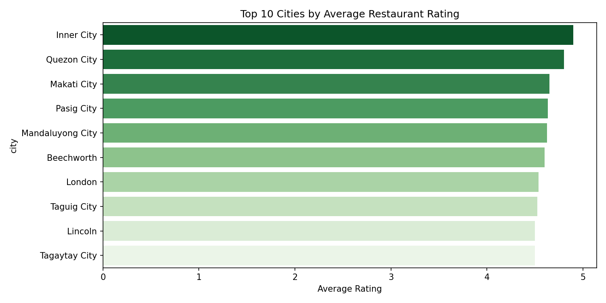
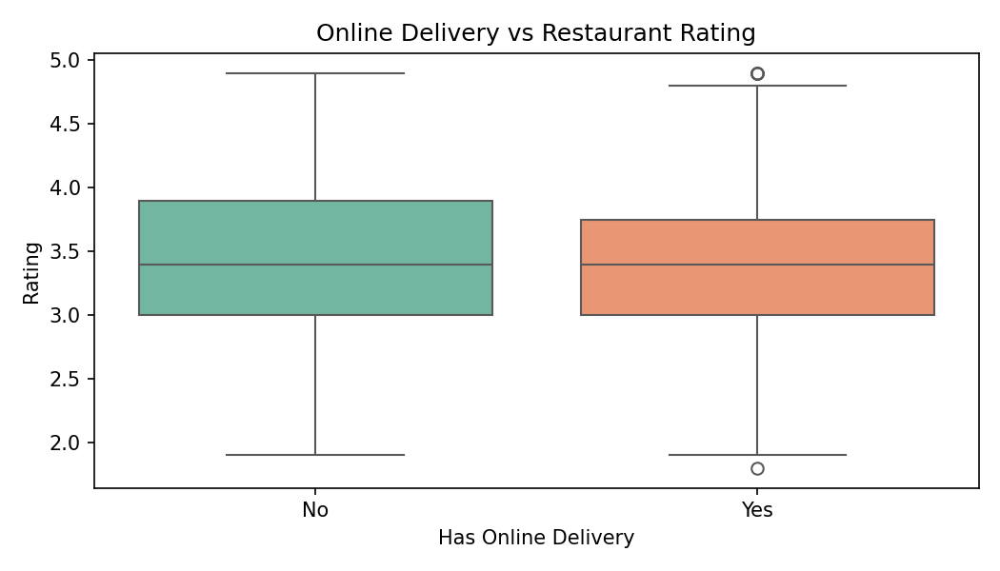
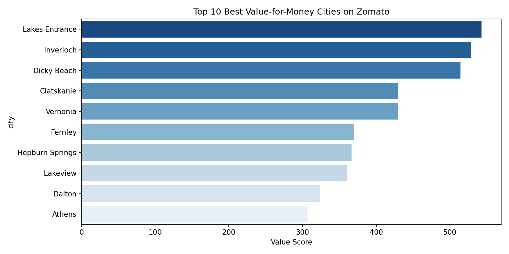

# Zomato Restaurant Intelligence Analysis

## Tools Used
- Excel — Pivot tables, charts, Value Score metric
- Python — Data cleaning, EDA, visualizations
- SQL — Business queries using DuckDB
- Power BI — Interactive dashboard

## What I Analyzed
- 9,551 restaurants across 15+ countries
- Top cities by average restaurant rating
- Impact of online delivery on ratings and cost
- Value-for-money score by city (my unique metric)

## Key Findings
- Inner City has the highest average rating of 4.9
- Restaurants with online delivery have better ratings
- Albany and Athens offer best value for money

## Files
- zomato_analysis.py — Python cleaning and charts
- zomato_sql.py — SQL business queries
- zomato_dashboard.pbix — Power BI dashboard
- zomato.xlsx — Excel pivot tables and charts

## Charts

